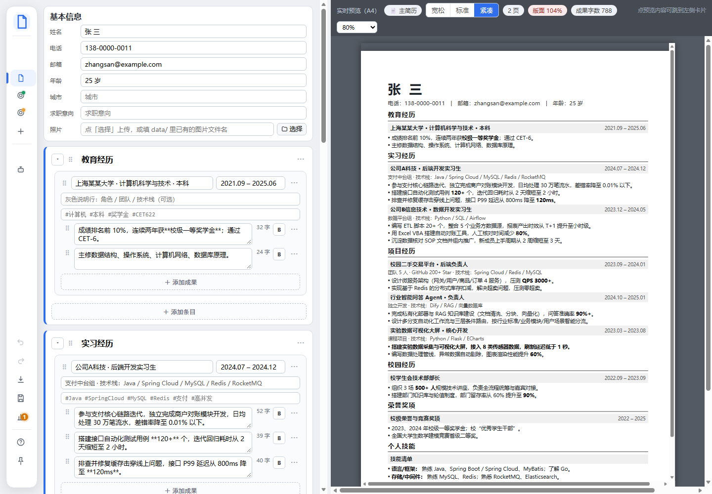
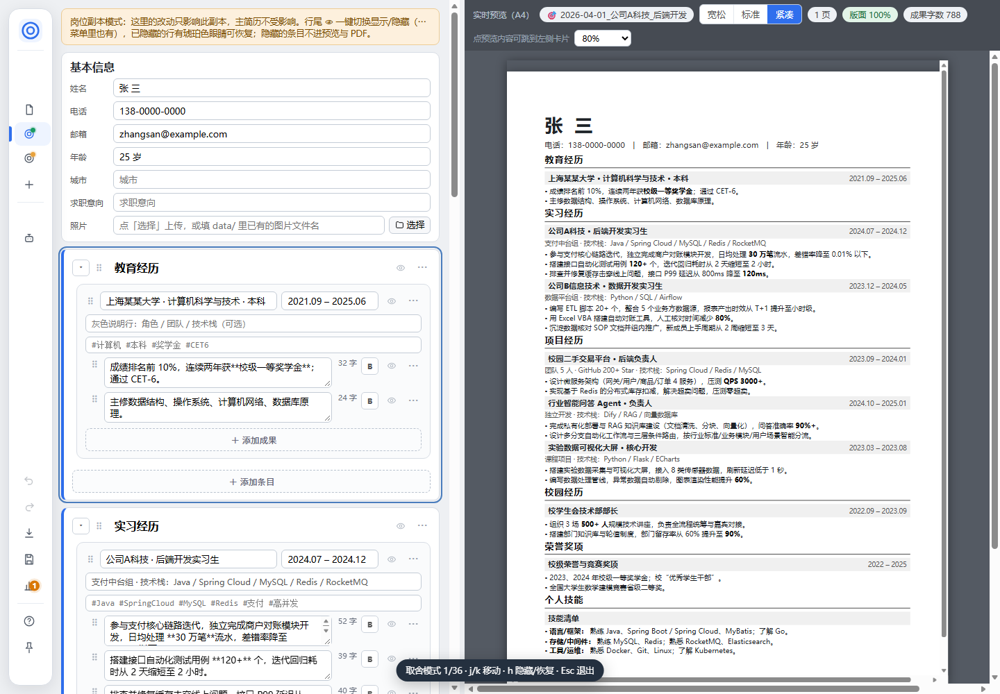
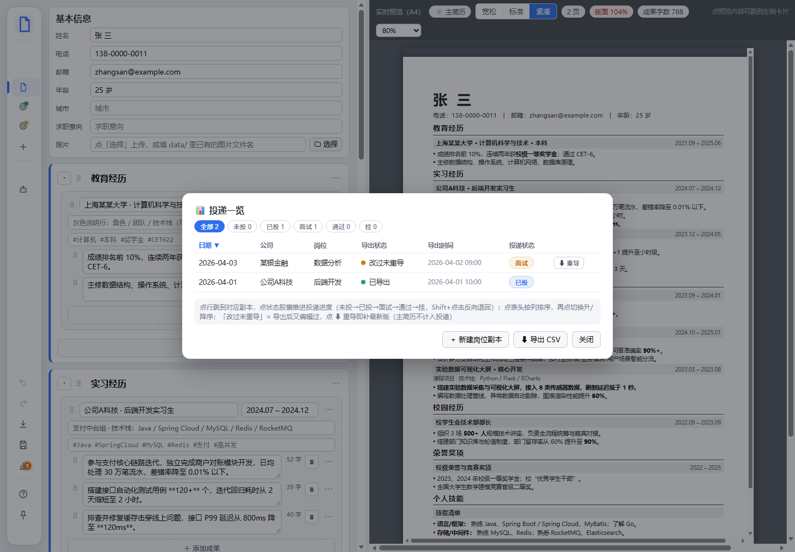
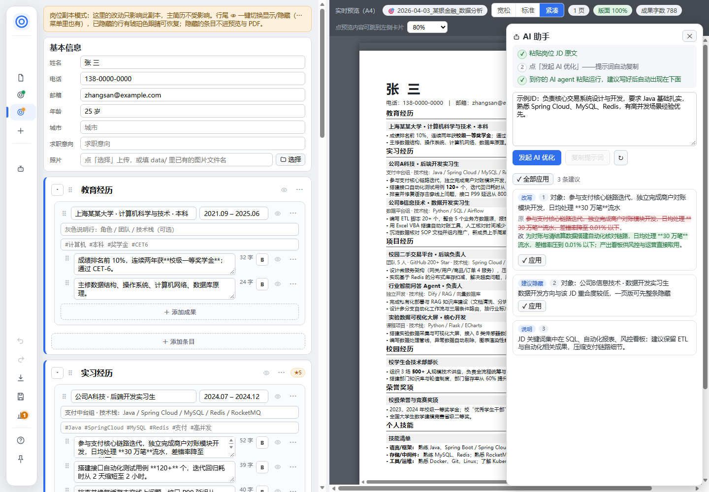

# 简历可视化编辑工作台

## 30 秒认识它

这是一个**纯本地**的简历快速调整工作台。

- 在左侧维护一份**完整主简历**（可以 2 页），全部经历沉淀在这。
- 投某个岗位时「＋新建岗位副本」，右侧 A4 实时预览，把内容取舍压到一页。
- 一键导出打印级 PDF。

数据全在本地 `data/` 目录；服务只监听本机 127.0.0.1，不联网。零第三方依赖（Python 标准库 + 原生 JS），打印调用系统已装的 Edge/Chrome 无头打印。

> ⚠️ 当前 data/ 里是**虚构示例（张三）**。替换成你自己的内容：直接在编辑器里改，或把真实简历交给 AI 助手拆解导入。

定位：**可视化编辑为主，AI 辅助**。人直接在界面里改；AI 负责分析 JD、给改写和取舍建议，**人始终拍板**。

## 怎么启动

```
双击 启动简历工作台.bat   # 桌面端：无窗口启动，自动打开浏览器（推荐）
python serve.py          # 或命令行启动（效果相同，编辑器 http://127.0.0.1:8618）
python export.py 主简历        # 命令行导出 PDF（可选）
python export.py jobs/某岗位
```

- **启动简历工作台.bat**：无黑窗启动（pythonw），自动打开编辑器；重复双击不会起第二个服务，只会再开一次页面
- **停止简历工作台.bat**：一键停止本机服务（按端口 8618 结束进程）

## 🤖 用 AI 快速安装（可选）

不想自己动手装？把下面这段**整段复制**给任意 AI 编程助手（ZCode、Claude Code、Cursor、通义灵码…），让它替你完成检查、自检、启动；你只需要最后在浏览器里确认一眼：

```text
请帮我安装并启动「简历可视化编辑工作台」。这是纯本地工具，零第三方依赖
（Python 标准库 + 原生 JS；打印用系统已装的 Edge/Chrome 无头打印）：

1. 还没有代码的话：git clone https://github.com/11122313211/resume-workbench.git
   并进入仓库目录（或从 GitHub 下载 zip 解压；已有代码则跳过这步）。
2. 环境检查：python --version 需要 3.10 及以上（作者以 3.12 验证）；Windows 自带 Edge 即可。
3. 自检：运行 python tools/verify.py --static，7 项应全部 PASS；
   有 FAIL 就把输出原样发给我，不要自行修改任何代码。
4. 启动：优先运行 启动简历工作台.bat（无窗口、自动开浏览器）；
   不行再用 python serve.py，编辑器地址 http://127.0.0.1:8618。
5. 验收：浏览器出现三栏编辑器、左侧有文档列表即成功。
   全程不要联网下载依赖，不要把 data/ 目录里的内容上传或发送到任何外部位置。
```

> 双击 bat 就能跑的，上一节「怎么启动」已经够了，这节可以跳过。装好后从「三步上手」继续。

## 三步上手

1. **启动**：双击 启动简历工作台.bat，浏览器自动打开编辑器。
2. **改成自己的经历**：在左侧主简历卡片里直接编辑，改动自动保存（右上角状态），刷新不丢。
3. **投第一个岗位**：左侧导航「＋新建岗位副本」→ 右侧预览里隐藏无关内容、压到一页 → 点「⬇ 导出 PDF」。

第一次用？首访有三步引导；导航里「引导与快捷键」或按 `?` 随时重看。

## 界面速览

打开编辑器后是三栏：**左侧悬浮导航 + 中间卡片编辑 + 右侧 A4 实时预览**，中间分隔条可**拖拽调整左右占比**（双击复位）。



*主简历视图：中间改内容、右侧即刻重排；顶部标尺实时报页数与版面占用（图中 2 页、版面 104%）。*

- 悬浮导航**悬停展开**（📌 可钉住），收起为图标栏、悬停**零延迟**展开；副本多时文档列表内滚动
- 导航上区=身份与内容（当前文档 + 保存状态徽标、文档列表一键切换、悬停副本行可 ✕ 删除、＋新建岗位副本、AI 助手）；下区=交付与元动作（导出 PDF / 保存 / 引导与快捷键 / 钉住导航 / 状态行）
- 密度、页数/版面标尺、字数、缩放（50%~100% 与**适应宽度**，档位记忆）都在预览工具条上；浏览器标签页标题**随文档联动**，多标签一眼分清
- **点预览里的内容可定位左侧对应卡片**（点照片可放大查看）

## 第一步：维护主简历（完整版，可 2 页）

**填基本信息**：「基本信息」卡：姓名/电话/邮箱/年龄/照片。

- 点照片行的「📂 选择」直接从本机选图，自动上传到 `data/`；**截图后直接 Ctrl+V 也能上传**
- 也可手动填已有图片文件名；填错名字输入框会**琥珀警示**——预览与导出将没有照片

**加经历**：「＋添加章节 / 条目 / 成果」。条目含 主体（公司·职位）、时间、灰色说明行、tags（AI 匹配用，不打印）。

- 成果用 `**加粗**` 标关键数字（按 `Ctrl+B` 加粗，再按一次取消）
- 卡片拖拽 ⠿ 排序；行尾 ⋯ 菜单：隐藏/恢复、上移/下移、删除

成果行写法对照（示例为虚构数据）：

> ✗ 参与对账模块开发
>
> ✓ 独立完成商户对账模块开发，日均处理 **30 万笔**流水，差错率降至 0.01% 以下

**保存与容错**（自动留了后路）：

- 改动自动保存（右上角状态），刷新不丢
- **关页兜底**：关闭/刷新标签页、切走标签页时，尚未落盘的修改会经 sendBeacon 立即补交，900ms 防抖窗口内关页也不丢字
- **多窗口保护**：同一份文档开了两个窗口时，后保存的一方会收到「刚被其他窗口修改过」的提醒（同文档 5 分钟只提醒一次），提醒自带**「打开历史备份」一键入口**，找回另一窗口的版本不用自己翻

## 第二步：新建岗位副本，取舍压到一页

**新建、改名、删除**：

- 左侧导航「＋新建岗位副本」→ 输入 `jobs/日期_公司_岗位`，如 `jobs/2026-04-01_公司A科技_后端开发`——投递一览的 日期/公司/岗位 三列就从文件名推导；同名副本会先确认再覆盖。创建后 toast 可**一键进入取舍模式**
- 副本名打错了：侧栏悬停该副本行，点 ✎ 改名（主简历不可改名、同名拒绝；已导出的 PDF 跟随改名），撤销 toast 兜底
- 副本不要了：侧栏悬停该副本行，点右侧 ✕ 删除（主简历不可删，连带清理已导出 PDF）
- 文档多时按 `/` 聚焦侧栏筛选框，按名称快速定位

副本自动复制主简历，之后在副本里做减法，**主简历始终不受影响**。

**取舍三件套**：

- **行尾 👁 一键**切换显示/隐藏（整节/整条/单条 bullet 都可以，⋯ 菜单里也有同一操作）。岗位副本里隐藏不影响主简历；主简历里隐藏则预览与导出都不显示（低频，可见行走 ⋯ 菜单）
- 已隐藏的条目变暗并带琥珀色眼睛（点一下恢复），且**自动压缩成一行窄条**——取舍越敛越紧凑
- **T 取舍模式**：按 `t` 进入（j/k 移动、h 隐藏/恢复、Esc 退出），大量条目逐条决策不用碰鼠标；退出时 toast 汇报已隐藏行数，可**一键导出 PDF** 直接收尾



*取舍模式：当前项蓝框高亮，底部 HUD 报进度与键位，整轮取舍手不离键盘。*

**收敛进度可见**：预览工具条「已隐藏 N」实时显示（N=0 不出现）；**点击 chip 直接进入取舍模式并定位到第一个隐藏条目**。

**几个贴心提示**：

- 时间列支持宽松格式提示（建议 `2024.06 ~ 至今`；非法格式 amber 提示，仅提示不阻断）
- **JD 相关性标记**：AI 面板贴上岗位 JD 后，行尾自动出现 `★n` 命中徽标（与 JD 关键词的重合度提示，取舍时优先保留命中的行；不贴 JD 则无痕）
- **主简历漂移提示**：副本行出现琥珀 ↑ = 主简历在该副本创建后更新过（悬停看说明）——考虑新建副本带入最新内容再取舍

**一页引擎实时工作**：内容不满版心 → 富余空间按比例摊到节/条目/条距**撑满**；内容超页 → 自动收紧（间距→行距→字号），顶部标尺显示页数与版面占用。排版细则见文末「一页引擎（排版规则）」。

## 第三步：导出 PDF

- 点「⬇ 导出 PDF」→ 与预览 1:1 的 A4 PDF 落到 `data/jobs/xxx.pdf` 并自动打开
- 主简历导出则为多页 PDF
- 导出成功会自动先保存

**交付体检**：点导出时自动体检可见内容——占位残留（「待补充」「XX公司」「某公司」等）、空内容行、缺联系方式会列成清单，你确认「仍要导出」或「取消导出」；带下划线的条目**点击直达问题卡片**（先修再导）；清单为空则直接导出，不打扰。

**导出状态点**：侧栏文档行图标角上，一眼看出 PDF 新旧。

- 绿点 = 该文档已导出且 PDF 是最新
- 琥珀点 = 导出后内容又改过（PDF 还是旧版，重导即可）
- 悬停可见详情

侧栏 📊 按钮上的**琥珀数字徽标** = 有 N 份副本导出后又改过，零点击提醒该补 PDF 了。

## 投递一览：管好你的投递台账

侧栏 📊 按钮打开**投递一览**：汇总全部岗位副本的 日期/公司/岗位/导出状态/导出时间（从副本名与导出记录推导，主简历不计入），按日期倒序——投了几家、哪份改过还没重导，一张表看清。



*投递一览：绿点=PDF 最新，琥珀点=改过未重导（⬇ 重导即补最新版）；行内胶囊点按推进投递状态（Shift+点击退回），底部「⬇ 导出 CSV」一表带走。*

- **点表头按任意列排序**（日期/公司/岗位/导出状态/导出时间/投递状态，再点切换升/降序，Tab 聚焦后回车同样可排序，CSV 同口径）；点行直接跳到对应副本（行也支持 Tab 聚焦 + 回车跳转）
- 行内**投递状态**胶囊点击循环推进：未投→已投→面试→通过→挂（悬停看下一状态，**Shift+点击**反向退回；Tab 聚焦后回车同样可推进/Shift+回车退回，⬇ 导出按钮同理键盘可达），底部汇总进度计数
- 顶部标签可**按投递状态筛选**（全部/未投/已投/面试/通过/挂，带计数）
- 未导出/改过未重导的行有 ⬇ **一键导出**（跳到该副本走标准导出链路，含交付体检）
- 底部「⬇ **导出 CSV**」把当前台账（含筛选结果）存为 CSV（UTF-8 BOM，Excel 直接打开不乱码），投了几家一表带走

投递状态记录在本地 `data/delivery.json`；副本改名/删除自动跟随，不碰简历内容本身。

## 历史备份：改坏了随时找回

每次覆盖保存前，旧版本自动留底到 `data/.backup/<文档名>/`（每份文档保留最近 10 份，超出自动淘汰）。

- 侧栏悬停任意文档行点 🕘，浏览备份列表，选一个版本「恢复此版本」——当前内容会先自动备份，恢复后 8s 内可点撤销反悔回去
- 副本**改名后备份历史跟着走**（新名下的 🕘 仍能看到改名前的全部留底）
- 想回退到某次保存前：把对应备份文件拷回 `data/`（或 `data/jobs/`）改名即可
- 留底只进本地磁盘，绝不入 git

## AI 帮我优化（人拍板）

不直连任何大模型 API：AI 优化走**本地文件交接**——你自己的 AI agent 与工作台通过 `data/` 里的两个文件传递内容（请求 `ai-request.json`、建议 `ai-suggestion.json`），全程本地。

三步闭环，全程有反馈：

1. 左侧导航「AI 助手」（或 `Ctrl+J`）→ 粘贴岗位 JD
2. 点「**发起 AI 优化**」，一次点击完成两件事：
   - 写入请求文件（含 JD、简历全文、输出协议与给 agent 的完整指令），**提示词自动复制**到剪贴板
   - 面板顶部三步引导条随进度打勾；按钮进入「⏳ 已等待 Ns · 点击取消」秒表态
3. 到你的 AI agent（任意新会话均可）粘贴运行——提示词已把项目路径、建议文件格式、质量要求、禁止改简历文件全部写明，agent 照做即可；agent 写完 `data/ai-suggestion.json` 的瞬间，建议**自动出现**在面板里



*AI 助手面板：顶部三步引导随进度打勾；改写建议自带「原/改」字符级对照（红删绿增），应用前先看到改了什么；每条可单独「✓ 应用」或「✓ 全部应用」，应用错了 Ctrl+Z 即回。*

**面板关着也不会错过**：侧栏 🤖 按钮亮起呼吸圆点 + toast 提醒（点 toast 上的「查看」直接打开面板），打开面板即熄灭；已看过的建议重开页面不重复提醒。

**采纳与应用**：

- 逐条「✓ 应用」（应用后自动滚动定位到对应卡片），或「✓ 全部应用」（一次撤销步整批回退）；每条可撤销
- **面板开着时按数字键 1-9 直接应用对应建议**
- 改写建议自带 原文/改写 字符级对照（删除段红、新增段绿），应用前先看到改了什么；隐藏/恢复建议显示对象全文摘要

**旧建议不会误用**：

- 点「发起」时旧建议先归档到 `data/ai-history/`（保留最近 20 份）再作废——误点可挽回；面板底部「历史建议」可只读回看（不带应用按钮，防止旧建议错档误用）
- 建议文件带 `for` 字段标记归属；打开别的文档看到旧建议时，面板会明确提示而不是让你误应用

建议文件协议 `data/ai-suggestion.json`：

```json
{"for": "jobs/2026-XX-XX_公司_岗位",
 "items": [
  {"type": "rewrite", "target": "b-xxx", "text": "改写后的成果（含**加粗**）", "reason": "对齐 JD 关键词"},
  {"type": "hide",    "target": "e-xxx", "reason": "与该 JD 无关"},
  {"type": "note",    "text": "整体建议…"}
]}
```

`type` 取值：`rewrite` 改写（text 填完整文本，**target 必须是成果行的 id**）/ `hide` 建议隐藏 / `show` 建议恢复 / `note` 说明；`target` 必须用请求文件 `doc` 里对应的条目 id。

agent 写坏格式时面板会诚实报错（绝不假成功）；改写目标不是成果行时应用会被跳过并提示，绝不写入无效数据。

## 快捷键速查

| 快捷键 | 作用 |
|---|---|
| `Ctrl+S` | 保存 |
| `Ctrl+E` | 导出 |
| `Ctrl+P` | 导出（同 Ctrl+E——拦下浏览器默认行为，避免把工作台界面整页打印出去） |
| `Ctrl+J` | AI 助手 |
| `Ctrl+B` | 加粗，再按一次取消（光标在加粗文字内时 B 按钮点亮；只在**成果行**输入框生效，JD 等其他文本框不受影响） |
| `Ctrl+F` | **文档内查找**：右上角查找条，章节/条目/成果全扫；Enter 下一处、Shift+Enter 上一处，命中行高亮并滚动居中，折叠章节自动展开 |
| `Ctrl+Z` / `Ctrl+Shift+Z` | 撤销 / 重做（侧栏 ↶/↷ 按钮同样可用，无改动时自动置灰） |
| `Alt+↑↓` | 切换文档 |
| `t` | **T 取舍模式**：j/k 移动、h 隐藏/恢复、Esc 退出 |
| `1-9` | AI 面板开着时，直接应用对应建议 |
| `/` | 聚焦侧栏筛选框 |
| `?` | 重看引导与快捷键 |
| `Esc` | 关弹层 |

## 常见问题

- **数据会传到网上吗？** 不会。服务只监听本机 127.0.0.1，不暴露局域网；数据全在本地 `data/` 目录，备份也只在本地磁盘，绝不入 git。
- **关页/断电会丢字吗？** 改动自动保存；关页瞬间 sendBeacon 补交兜底；历史备份每文档再留 10 份。
- **两个窗口编辑同一份会冲突吗？** 后保存的一方会收到提醒（同文档 5 分钟只提醒一次），可去「历史备份」找回。
- **PDF 内容怎么不是最新的？** 看侧栏**导出状态点**：琥珀点 = 改过未重导，重导即可。
- **AI 建议应用错了？** 每条可撤销，`Ctrl+Z` 逐级回退；「全部应用」也整批一次回退。

## 面向维护者：技术速览

### 目录结构

```
├── serve.py                       # 本地服务 + API（零依赖，单实例保护）
├── export.py                      # 命令行导出
├── 启动/停止 .bat                  # 桌面端快速启动/停止
├── app/                           # 编辑器（index/editor/preview/print）
├── tools/printer.py               # 无头打印引擎（argv 全字面量）
├── tools/verify.py                # 自动验证清单：python tools/verify.py（改动后、提交前必跑；--static 为秒级静态门禁）
├── tools/hooks/pre-commit         # 提交闸门（git config core.hooksPath tools/hooks 启用）：STATIC 不过阻止提交
├── PROJECT.md                     # 项目手册：铁律 / 研发闭环 / 迭代记录 / 路线图
└── data/                          # 主简历.json + jobs/*.json + 照片 + AI 请求/建议
```

### 数据模型（data/*.json）

```
{ "kind": "master|job", "name": "主简历|jobs/xxx",
  "meta": {"姓名","电话","邮箱","年龄","城市","求职意向","照片","密度"},
  "sections": [ { "id","标题","hidden",
    "entries": [ { "id","left","right","meta","tags","hidden",
      "bullets": [ {"id","text","hidden"} ] } ] } ],
  "job": {"jdText","notes"} }        // 仅岗位副本
```

### 一页引擎（排版规则）

- A4 版心 = 天头 20mm / 左右 18mm / 地头 18mm
- 岗位副本强制一页：超页逐级收紧（节间距→行距 1.42→1.3→正文 10→9.5pt）
- 内容不满：富余空间按比例摊到 节/条目/条距 三级间距整体拉伸撑满版心（拉伸上限随密度档 2.2×/2.6×/3.4×，防失真）——**不会出现底部异常空白**
- 主简历不强制页数，预览画出页界线

### 交互约定（全站统一）

| 类型 | 反馈 | 例子 |
|---|---|---|
| 切换类 | 即时生效 + 按压态可视（`.on` 蓝色），不弹 toast | 密度档 / 显示隐藏 👁 / 折叠 / 加粗 B |
| 破坏类 | 确认弹窗 → 完成后 toast 带「撤销」按钮 | 删除 / 超页导出 / 移除照片 / 应用 AI 建议 |
| 全局类 | 状态行/chip/toast；**成功类就地短暂表态后归于无痕**（不弹 toast），toast 只留给例外与交付 | 保存 / 导出 / 上传 / AI 就绪 |

撤销粒度：打字按 600ms 停顿合帧；切换类操作（加粗、密度、隐藏、AI 应用…）每次独立成一步，`Ctrl+Z` 逐级回退。

### 边界与说明

- 隐私：内置内容均为虚构示例；真实个人信息只在你确认导入时写入。**提交闸门默认拒绝任何 `data/` 变更进 git**（含 `git add -A` 误暂存）；确要提交核验过的示例数据，用 `VERIFY_ALLOW_DATA=1 git commit` 显式放行
- 导出的 PDF 与预览完全一致（同一渲染引擎 + 同一排版算法，MediaBox 实测 210×297mm）
- 项目文件夹移动/改名后需同步 `tools/printer.py` 顶部路径常量（启动时会校验提示）
